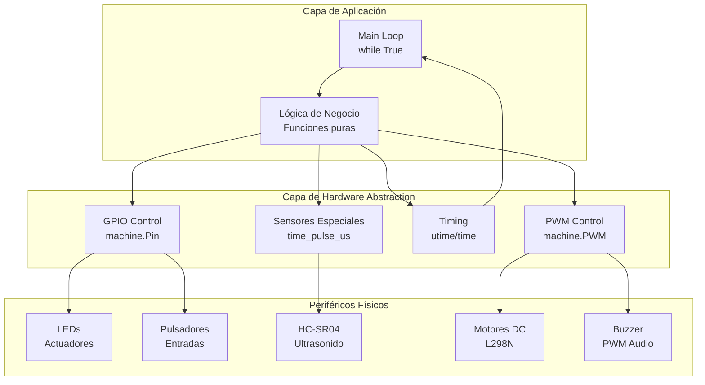

# Arquitectura del Sistema

> [!info] Visión General
> Los scripts siguen una arquitectura **basada en bucles de eventos (event-loop)** típica de sistemas embebidos sin RTOS. Cada script es autónomo, sin dependencias cruzadas entre ejercicios, pero comparten patrones comunes de inicialización, bucle principal y limpieza.

---

## Diagrama General de Arquitectura



---

## Flujo de Datos Global

```mermaid
sequenceDiagram
    participant Boot as Boot/Import
    participant Init as Inicialización HW
    participant Loop as Main Loop
    participant Logic as Lógica de Control
    participant HW as Hardware I/O
    participant Clean as Cleanup
    
    Boot->>Init: Cargar módulos (machine, utime)
    Init->>Init: Configurar pines (IN/OUT/PWM)
    Init->>Init: Establecer estados seguros (OFF/LOW)
    Init->>Loop: Entrar al bucle infinito
    
    loop Cada Iteración
        Loop->>Logic: Leer sensores / Evaluar condiciones
        Logic->>HW: Escribir actuadores (LED, Motor, Buzzer)
        HW-->>Logic: Confirmación implícita
        Loop->>Time: Sleep / Delay (yield CPU)
    end
    
    Note over Loop,Time: Interrupción (Ctrl+C)
    Loop->>Clean: KeyboardInterrupt
    Clean->>HW: Apagar salidas (Seguridad)
    Clean->>Boot: Exit
```

---

## Patrones de Diseño Identificados

### 1. **Factory Pattern (Implícito) - `setup_*` functions**
```python
# ejercicio1_led.py:13-24
def setup_led(pin_number) -> machine.Pin:
    return machine.Pin(pin_number, machine.Pin.OUT)

# ejercicio3_pulsador.py:14-29
def setup_components() -> tuple[machine.Pin, machine.Pin]:
    led = machine.Pin(2, machine.Pin.OUT)
    pulsador = machine.Pin(4, machine.Pin.IN, machine.Pin.PULL_UP)
    return led, pulsador
```
- Encapsula la configuración de hardware
- Permite reutilización y testing

### 2. **Command Pattern - Funciones de Acción Atómicas**
```python
# motor_control.py:41-89
def avanzar(velocidad: int = 60): ...
def retroceder(velocidad: int = 60): ...
def girar_izquierda(velocidad: int = 50): ...
def girar_derecha(velocidad: int = 50): ...
def detener(): ...
```
- Cada función es un "comando" completo
- Facilita secuencias complejas

### 3. **Guard Clause - Validación Temprana**
```python
# sonar_sensor.py:30-33
if duracion_us < 0:
    return -1  # Error temprano

# alarma_ultrasonica.py:42-55
if distancia != -1:
    # Lógica principal
else:
    print("Lectura fuera de rango.")
```

### 4. **Resource Acquisition Is Initialization (RAII) - Try/Finally Implícito**
```python
# Todos los scripts principales
try:
    while True:
        # Lógica principal
except KeyboardInterrupt:
    led.value(0)  # Limpieza garantizada
    print("Ejecución detenida por el usuario.")
```

### 5. **Debounce por Software - Polling con Delay**
```python
# ejercicio3_pulsador.py:62
utime.sleep_ms(50)  # Antirrebote básico

# Ejercicio 2.py:57
sleep(0.1)  # Pequeña pausa para evitar rebotes

# alarma_ultrasonica.py:58
sleep_ms(200)  # Evitar colisión de ecos
```

---

## Configuración de Pines por Ejercicio

| Ejercicio | GPIO | Función | Modo | Comentario |
|-----------|------|---------|------|------------|
| 1. Blink | 2 | LED integrado | OUT | LED built-in ESP32 |
| 2. Semáforo+Btn | 0,1,2 | LEDs R/A/V | OUT | Ánodo común a GPIO |
| 2. Semáforo+Btn | 3 | Botón peatón | IN, PULL_DOWN | Activo en HIGH |
| 2. Semáforo+Btn | 4 | Buzzer | PWM | 50% duty cycle |
| 3. Pulsador | 2 | LED | OUT | Controlado por botón |
| 3. Pulsador | 4 | Pulsador | IN, PULL_UP | Activo en LOW |
| 4. Semáforo Simple | 21,22,23 | LEDs V/A/R | OUT | Secuencia temporizada |
| 5. Alarma US | 5 | Trigger US | OUT | Pulso 10µs |
| 5. Alarma US | 18 | Echo US | IN | Medición tiempo |
| 5. Alarma US | 2 | LED Alarma | OUT | Rojo |
| 5. Alarma US | 15 | Buzzer | OUT | Alarma sonora |
| 6. Sonar Sensor | 18 | Trigger | OUT | Módulo reutilizable |
| 6. Sonar Sensor | 19 | Echo | IN | Timeout 20ms |
| 7. Motor Control | 12,13 | IN1, IN2 | OUT | Motor Izquierdo |
| 7. Motor Control | 14 | ENA | PWM | Velocidad Izq (1kHz) |
| 7. Motor Control | 15,16 | IN3, IN4 | OUT | Motor Derecho |
| 7. Motor Control | 17 | ENB | PWM | Velocidad Der (1kHz) |

---

## Métricas de Complejidad

| Script | Líneas | Funciones | Complejidad Ciclomática | Patrones |
|--------|--------|-----------|------------------------|----------|
| ejercicio1_led.py | 60 | 3 | 2 | Factory, RAII |
| ejercicio3_pulsador.py | 70 | 3 | 3 | Factory, RAII, Debounce |
| semaforo_inteligente.py | 30 | 0 | 1 | Secuencial simple |
| Ejercicio 2.py | 57 | 2 | 4 | Command, State Machine |
| alarma_ultrasonica.py | 58 | 1 | 3 | Guard Clause, RAII |
| sonar_sensor.py | 84 | 2 | 4 | Factory, Guard Clause |
| motor_control.py | 108 | 7 | 2 | Command, Factory |

---

## Consideraciones de Rendimiento (MicroPython/ESP32)

> [!warning] Limitaciones Conocidas
> - **GIL**: MicroPython tiene GIL, no hay verdadero paralelismo
> - **GC**: Recolección de basura no determinística → evitar alloc en loop
> - **Timing**: `sleep_us`/`sleep_ms` no son precisos bajo carga
> - **PWM**: Frecuencia fija 1kHz en L298N, resolución 16-bit (0-65535)

### Optimizaciones Aplicadas
1. **Pre-cálculo de constantes** fuera del loop (`duty_u16` scaling)
2. **Reutilización de objetos Pin** (no re-instanciar en loop)
3. **Lecturas agrupadas** (mínimas transacciones I/O por iteración)
4. **Timeouts en sensores** (evitan bloqueo infinito en `time_pulse_us`)

---

🔗 [[_Agent_Sync/Task_Board]]
🔗 [[_Agent_Sync/Active_Context]]